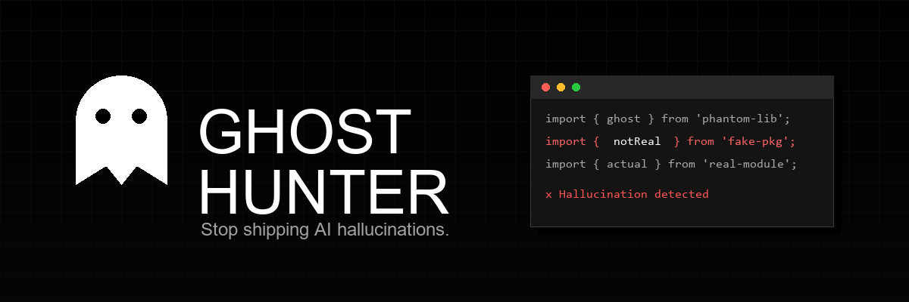

<div align="center">
  
</div>

<div align="center">


</div>

---

## 🚀 Features

- **Deterministic Validation** - Verify every import against your actual installed modules. No guessing or regex.
- **Zero Configuration** - Works out of the box. Just run `npx ghost-hunter` in your project root.
- **CI/CD Ready** - Fails the build if hallucinations are detected. Preventing bad code from merging.

---

## 🤔 What is a Hallucination?

AI coding assistants often suggest imports that **look real but don't exist**. Ghost Hunter catches these bugs before they break your app.

### Examples of what Ghost Hunter catches:

**1. The "Fake Function" Hallucination**
```typescript
import { nonexistent } from 'fs'; 
// ❌ Error: 'fs' exists, but it has no export named 'nonexistent'.
```

**2. The "Wrong Library" Hallucination**
```typescript
import { notARealColor } from 'chalk'; 
// ❌ Error: 'chalk' exists, but 'notARealColor' is not a valid color.
```

**3. The "Ghost Dependency" Hallucination**
```typescript
import { utils } from 'dependency-i-never-installed'; 
// ❌ Error: Module 'dependency-i-never-installed' is not in node_modules.
```

---

## 📦 Installation

### npx (Recommended)
```bash
npx ghost-hunter .
```

### Global Install
```bash
npm install -g ghost-hunter
```

---

## 🛠️ Usage

### Basic Usage
```bash
# Scan current directory
npx ghost-hunter .

# Scan specific directory
npx ghost-hunter ./src/components
```

### CI/CD Integration
Add to your GitHub Actions or GitLab CI:
```yaml
- name: Detect Hallucinations
  run: npx ghost-hunter .
```

### Command Line Options
- `--help` - Show all commands
- `--json` - Output as JSON
- `--ignore` - Ignore patterns (glob)

---

## ⚙️ Configuration

Ghost Hunter supports a `.ghostrc` file:

```json
{
  "exclude": ["dist", "coverage", "**/*.test.ts"],
  "rules": {
    "no-unused": "error",
    "hallucination": "error"
  }
}
```

---

## 🌐 Website

This repository contains the marketing website for Ghost Hunter, built with:

- **React 19** - UI framework
- **TypeScript** - Type safety
- **Vite** - Build tool
- **Tailwind CSS** - Styling
- **Framer Motion** - Animations

### Development

```bash
# Install dependencies
npm install

# Start dev server
npm run dev

# Build for production
npm run build

# Preview production build
npm run preview
```

---

## 📄 License

MIT License - see [LICENSE](LICENSE) for details

---

## 🤝 Contributing

Contributions are welcome! Please feel free to submit a Pull Request.

---

## 📧 Contact

- GitHub: [@01Developer95](https://github.com/01Developer95)
- Repository: [Ghost-Hunter](https://github.com/01Developer95/Ghost-Hunter)

---

**Built with ❤️ to make AI-assisted coding safer.**
